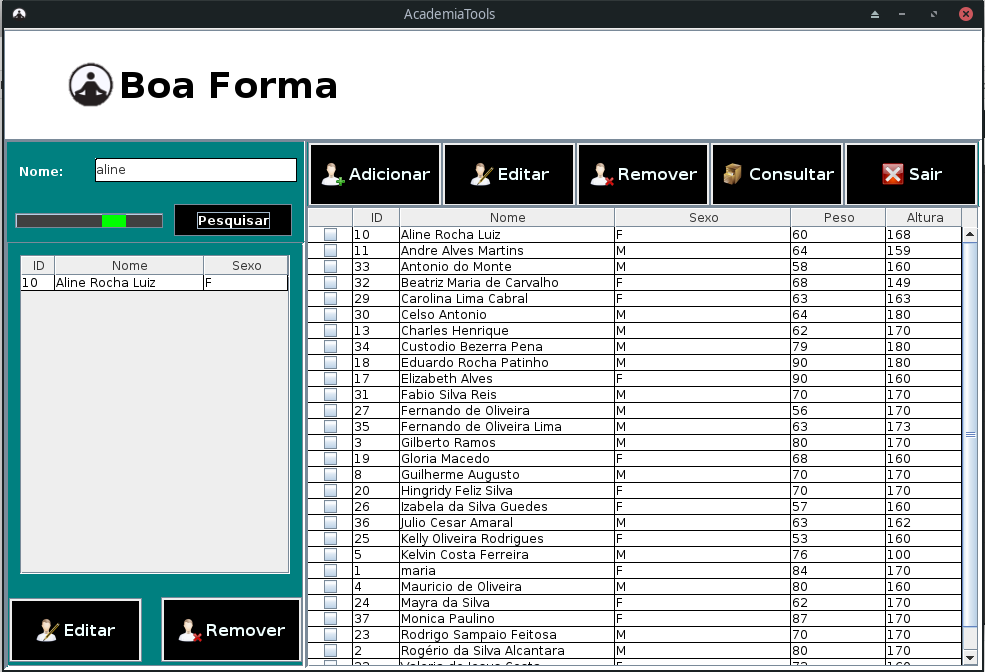
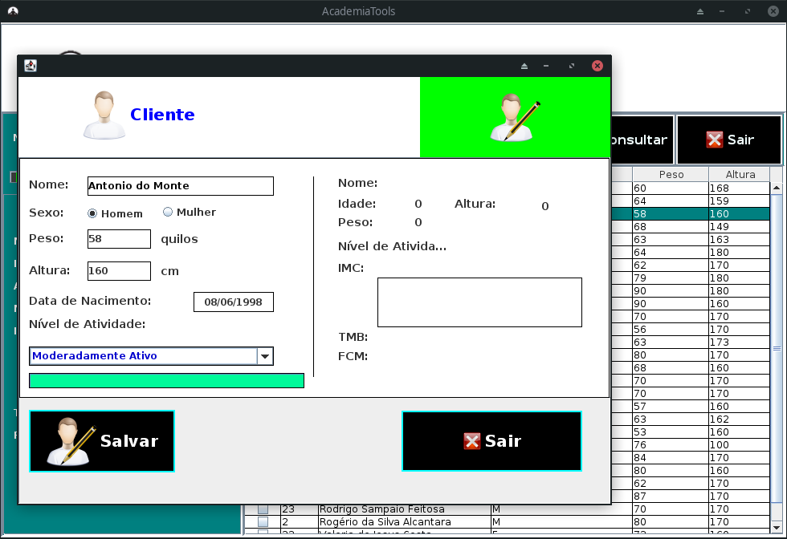

# Boa Forma

  Sistema Desktop de cadastro de clientes feito em java SE(Desktop), para uma academia.

## Bibliotecas

* [Swing](https://pt.wikipedia.org/wiki/Swing_(Java)) - Plataforma para desenvolvimento Desktop multiplataforma com Java
* [Ucanaccess](http://ucanaccess.sourceforge.net/site.html) - Biblioteca para conexão com o banco de dados Microsoft Access
